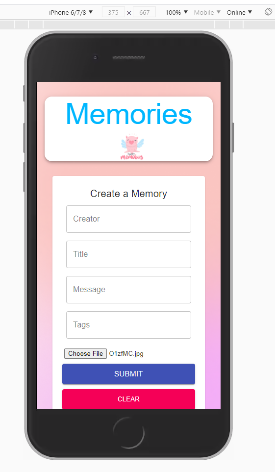

memory-tracker-mern-app

React, Node.js, Express & MongoDB, redux, material-UI

- (How to use redux, react-redux, thunk framework)
- filebase to upload file

2021-1-11

```
npm install
```

to install all independences in client folder and server folder before start.

Port: 5000 for backend


<br>


